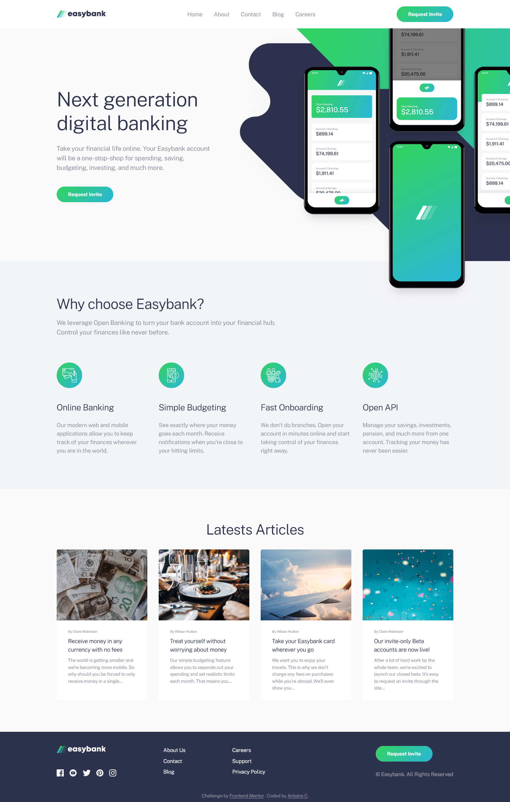
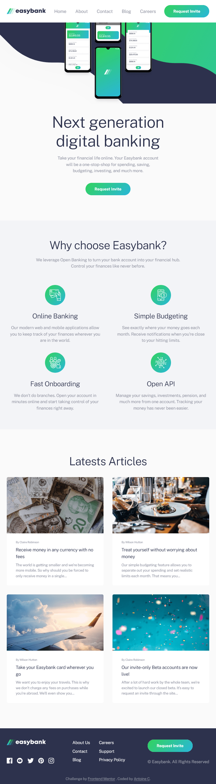
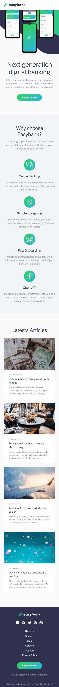

# Frontend Mentor - Easybank landing page solution

This is a solution to the [Easybank landing page challenge on Frontend Mentor](https://www.frontendmentor.io/challenges/easybank-landing-page-WaUhkoDN). Frontend Mentor challenges help you improve your coding skills by building realistic projects.

## Table of contents

- [Overview](#overview)
  - [The challenge](#the-challenge)
  - [Screenshot](#screenshot)
  - [Links](#links)
- [My process](#my-process)
  - [Built with](#built-with)
  - [What I learned](#what-i-learned)
  - [Useful resources](#useful-resources)
- [Author](#author)
- [Contribution](#contribution)

## Overview

### The challenge

Users should be able to:

- View the optimal layout for the site depending on their device's screen size
- See hover states for all interactive elements on the page

### Screenshot

- Desktop (1440px)



- Tablet (768px)



- Mobile (375px)



### Links

- Solution URL: [https://www.frontendmentor.io/solutions/easybank-landing-page-astro-typescript-postcss-iNp4_hP-uf](https://www.frontendmentor.io/solutions/easybank-landing-page-astro-typescript-postcss-iNp4_hP-uf)
- Live Site URL: [https://easybank-landing-page-acdev.vercel.app/](https://easybank-landing-page-acdev.vercel.app/)

## My process

### Built with

- Semantic HTML5 markup
- CSS custom properties
- Flexbox
- CSS Grid
- Mobile-first workflow
- [Typescript](https://www.typescriptlang.org/)
- [Astro](https://astro.build/)
- [Postcss](https://postcss.org/)

### What I learned

#### CSS Modules in astro

Last time I wordked with Astro, I used the "Astro way" which is writing inline-styles inside each components. However I prefer having a separate stylesheet. I discovered that CSS Modules are supported in Astro which gave me the best of both worlds: `separation of concerns` & `scoped-styles`.

#### Astro Icon component

This component imbeds your svgs inside the html (less resources to fetch on the browser) and optimize them throught [svgo](https://github.com/svg/svgo). It will also forward any html attribute to the generated svg so it gives you the ability to slyle them which is not possible with an img tag (except width/height)

#### Custom button gradient

The design required to change the opacity of the gradient without changing the element itself so I used the `::after` pseudo-element.

```css
.btn-gradient {
  position: relative;
  isolation: isolate;
  cursor: pointer;
  padding-inline: var(--space-lg);
  height: 44px;
  border-radius: var(--br-lg);
  color: hsl(var(--clr-neutral-100));
  font-size: var(--fs-xs);
  font-weight: var(--fw-bold);
  background-color: hsl(var(--clr-neutral-100));
}

.btn-gradient::after {
  content: '';
  position: absolute;
  z-index: -1;
  inset: 0;
  border-radius: var(--br-lg);
  background: var(--gradient-default);
  transition: opacity 250ms ease-in-out;
}

.btn-gradient:hover::after,
.btn-gradient:focus-visible::after {
  opacity: 0.6;
}
```

### Useful resources

- [Astro Documentation](https://docs.astro.build/en/getting-started/) - All-in-one web framework for building fast, content-focused websites.
- [Astro Icon](https://github.com/natemoo-re/astro-icon) - A straight-forward Icon component for Astro.
- [Postcss Preset Env](https://preset-env.cssdb.org/) - Start using modern CSS today.
- [Utopia](https://utopia.fyi/) - Elegantly scale typo and space without breakpoints.

## Author

- Frontend Mentor - [@AntoineC-dev](https://www.frontendmentor.io/profile/AntoineC-dev)

## Contribution

You can use this project for whatever you want. Don't forget to leave a ⭐.

- Fork the project to add it to your githug repositories.
- Clone it on your local machine from you repositories.
- Install all the dependencies by running `npm install` or `yarn` or `pnpm` from a terminal located in the project.
- Open the project in your editor and start coding.
